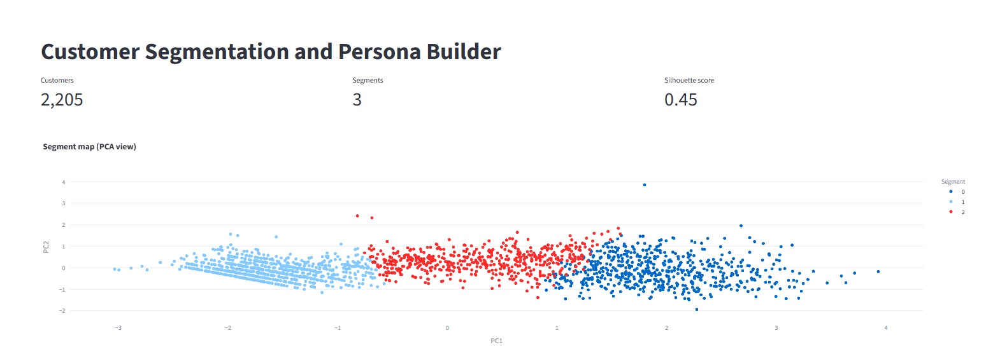
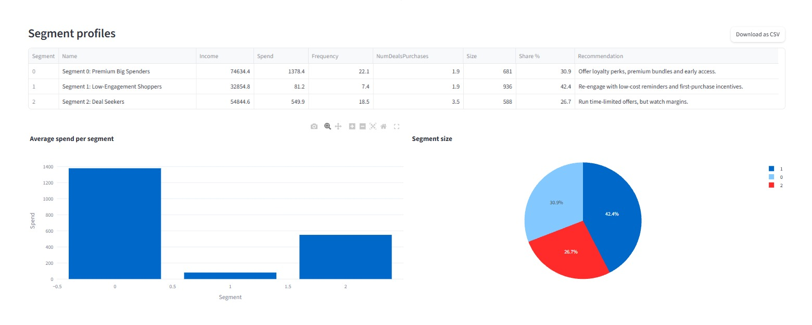
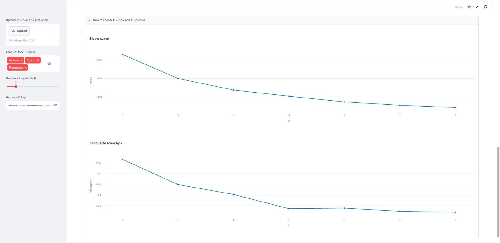

# Customer Segmentation and Persona Builder

Interactive dashboard that groups customers into segments and generates AI marketing personas.

**Live app:**[Open the dashboard](https://your-app-name.streamlit.app)

## Screenshots

### Overview and segment map

### Segment profiles and charts

### Choosing k and AI personas

## Business question
Which customer groups should a marketer prioritise, and what should be done for each?

## Data
Public Marketing Analytics dataset from Kaggle (ifood_df.csv), 2,205 customers.

## Method
- Built Spend (sum of product purchases) and Frequency (sum of purchases across channels) features
- Standardised Income, Spend and Frequency, then clustered with K-Means
- Chose k = 3 using elbow and silhouette analysis. Silhouette was highest at k = 2 (about 0.57), but that only splits customers into high and low value, so k = 3 (silhouette 0.45) gives more actionable segments
- Gemini API generates a persona and campaign ideas for each segment

## Key insights
1. Premium Big Spenders are 30.9% of customers but about 70% of total spend (average spend 1,378 vs 81 for the lowest segment).
2. Low-Engagement Shoppers are the largest group (42.4%) but contribute only about 6% of spend.
3. Deal Seekers (26.7%) make 3.5 deal purchases on average, almost double the other segments (1.9), and contribute about 24% of spend.
4. Premium Big Spenders buy at full price more than Deal Seekers, so blanket discounts would cut margin with little gain.

## Recommendations
| Segment | Action |
|---|---|
| Premium Big Spenders | Loyalty perks, early access, premium bundles. Avoid discount-led offers. |
| Deal Seekers | Time-limited offers and bundles with a minimum basket size. Track margin. |
| Low-Engagement Shoppers | Low-cost reminders and first-purchase incentives with a capped budget. |

## Tech stack
Python, Streamlit, scikit-learn, Plotly, Gemini API

## How to run locally
1. Install packages: `pip install -r requirements.txt`
2. Run: `streamlit run app.py`

## Note
Spend and Income are shown in dataset units because the source does not state a currency. The Gemini persona feature needs your own free API key, entered in the sidebar.
